<!-- _class: lead -->

# **inkai-app**
## Aplikasi untuk Mengelola Organisasi

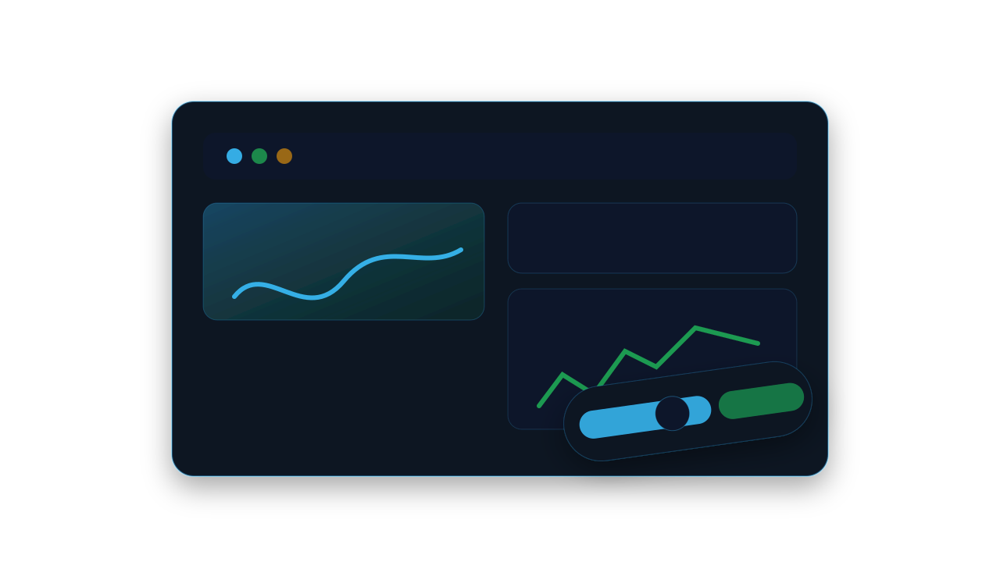

*Satu aplikasi — semua pengurus bisa pakai — data rapi dan aman*

---

## Apa itu inkai-app?

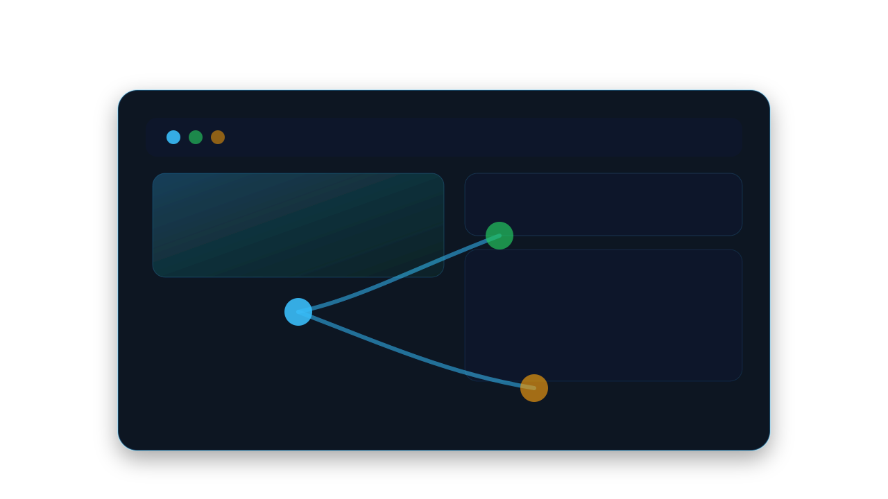

**inkai-app** adalah aplikasi berbasis web (diakses lewat browser) untuk **mengelola organisasi** dari tingkat ranting hingga pusat.

- Semua data **di satu tempat** (keanggotaan, keuangan, ujian, event, dll.)
- **Login aman** — hanya yang punya akun yang bisa masuk
- **Setiap orang lihat yang perlu saja** — admin ranting beda dengan ketua cabang
- Bisa dipakai dari **HP atau laptop**, kapan saja ada internet

---

## Untuk Siapa?

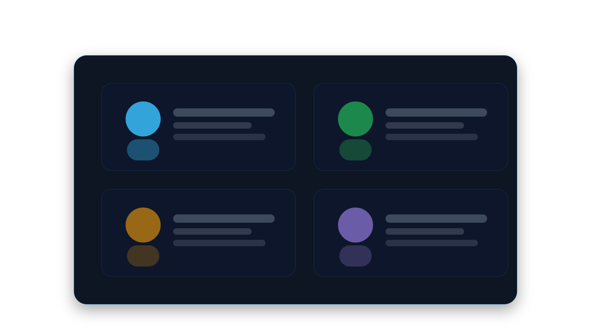

| Pengguna | Apa yang bisa dilakukan |
|----------|-------------------------|
| **Admin Ranting** | Input data anggota ranting, cetak kartu anggota, kelola ujian tingkat |
| **Ketua Cabang** | Lihat semua ranting di cabang, laporan keuangan, pendaftaran UKT |
| **Pengurus Provinsi** | Pantau cabang-cabang, statistik wilayah |
| **Superadmin** | Kelola semua pengguna, atur menu, tambah user baru |

*Satu aplikasi, banyak peran — sesuai jabatan masing-masing.*

---

## Keuntungan Pakai inkai-app

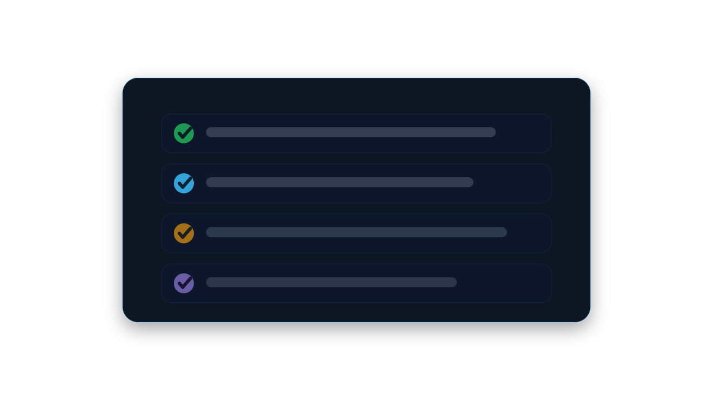

✅ **Data terpusat** — Tidak perlu lagi data tersebar di banyak file Excel atau WhatsApp  
✅ **Hemat waktu** — Cari data anggota atau cetak kartu tinggal klik  
✅ **Aman** — Login dengan akun sendiri; yang bukan pengurus tidak bisa akses  
✅ **Transparan** — Laporan keuangan dan ujian bisa dilihat sesuai level  
✅ **Kartu anggota digital** — Bisa dicetak kapan saja, tidak perlu antre ke kantor  

---

## Tampilan Utama: Dashboard

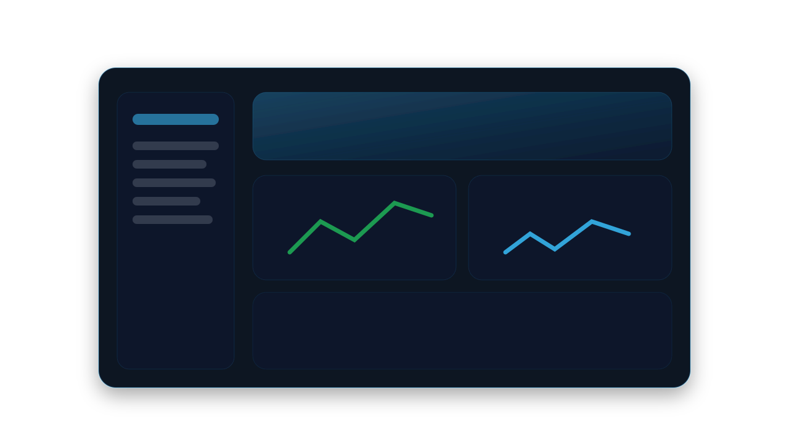

Setelah login, Anda masuk ke **Dashboard** — layar utama yang menampilkan:

- **Ringkasan** — Jumlah event aktif, statistik singkat
- **Feed / pengumuman** — Kabar terbaru dari organisasi
- **Menu di sisi kiri** — Untuk masuk ke fitur-fitur lain (keanggotaan, keuangan, ujian, dll.)

*Menu yang muncul menyesuaikan jabatan Anda — tidak semua orang lihat menu yang sama.*

---

## Fitur 1: Keanggotaan

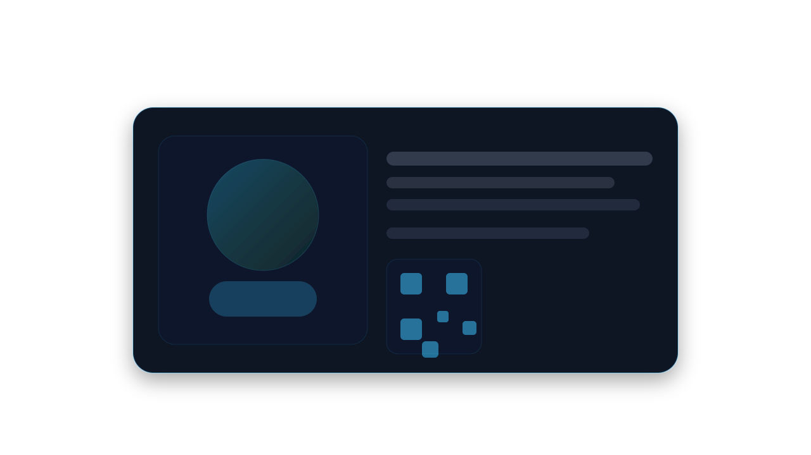

**Untuk apa?** Mengelola data anggota organisasi.

- **Input & edit data anggota** — Nama, alamat, kontak, foto
- **Alamat lengkap otomatis** — Pilih provinsi, kabupaten, kecamatan, desa — tidak perlu ketik manual
- **Kartu anggota digital** — Bisa di-preview dan dicetak (PDF) kapan saja
- **Data prestasi & sabuk (Kyu/Dan)** — Riwayat kenaikan tingkat tersimpan rapi
- **Pindah ranting** — Jika anggota pindah, bisa dicatat di sini
- **Pelatihan** — Catat pelatihan yang pernah diikuti

---

## Fitur 2: Ujian Kenaikan Tingkat (UKT)

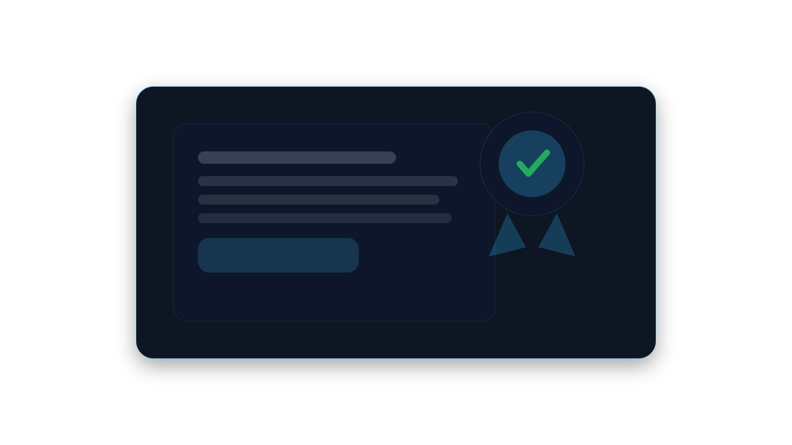

**Untuk apa?** Mengelola pendaftaran dan pelaksanaan ujian kenaikan tingkat.

- **Pendaftaran UKT** — Anggota mendaftar lewat sistem
- **Kwitansi** — Cetak kwitansi pembayaran untuk peserta ujian
- **Laporan per cabang/ranting** — Siapa saja yang ikut ujian, statusnya seperti apa
- **Riwayat UKT** — Data ujian terdahulu tetap tersimpan

---

## Fitur 3: Keuangan

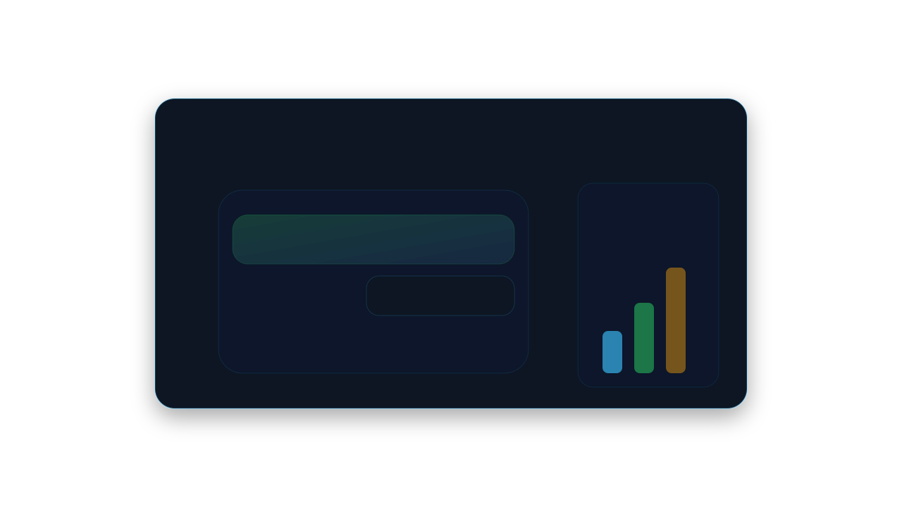

**Untuk apa?** Mengelola keuangan organisasi.

- Pencatatan pemasukan dan pengeluaran
- Laporan keuangan per periode
- Transparansi sesuai level akses (ranting, cabang, pusat)

---

## Fitur 4: Pertandingan & Event

**Untuk apa?** Mengelola pertandingan dan kegiatan organisasi.

- Daftar pertandingan
- Event aktif
- Informasi terbaru bisa ditampilkan di dashboard

---

## Fitur 5: Ranting & Anggota Ranting

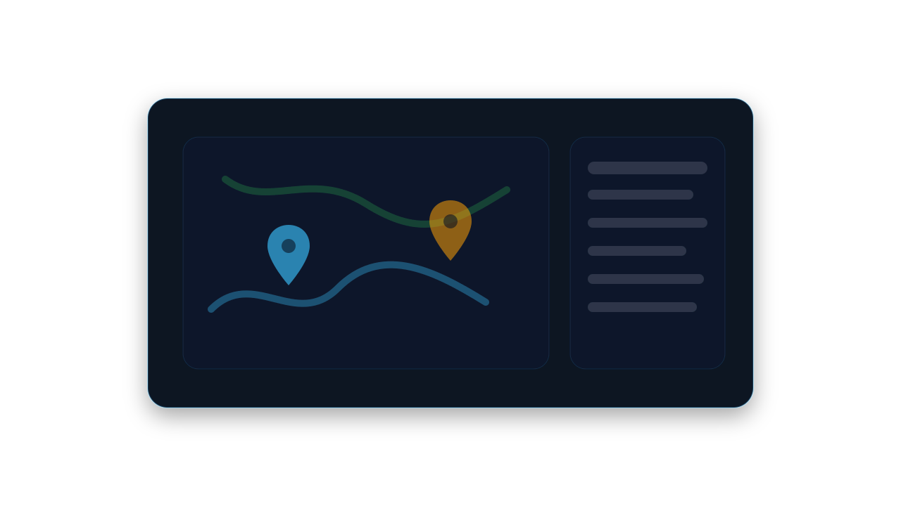

**Untuk apa?** Mengelola struktur ranting dan daftar anggota per ranting.

- **Ranting** — Data ranting (nama, lokasi, status aktif)
- **Anggota Ranting** — Siapa saja anggota di tiap ranting
- Terhubung dengan data keanggotaan dan wilayah

---

## Fitur 6: Home Base

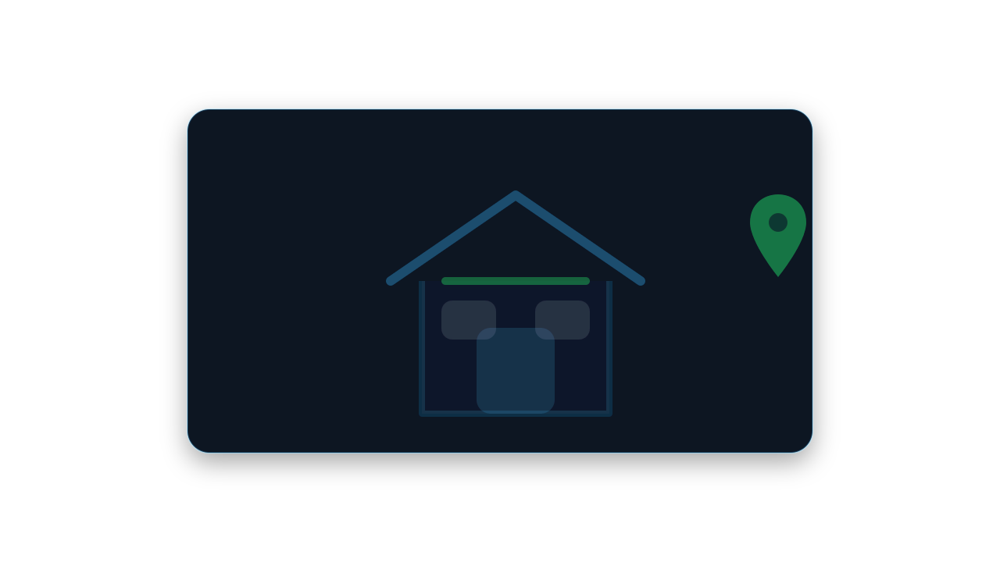

**Untuk apa?** Mengelola "home base" atau tempat latihan (dojo) per ranting.

- Informasi lokasi latihan
- Data dojo/ranting yang aktif

---

## Fitur 7: Konten Dashboard (Berita, IG, Marketplace)

**Untuk apa?** Membuat konten yang tampil di beranda dashboard, tanpa ribet dan tetap aman.

- **Berita/Feed**: pengumuman, event, info dojo
- **Instagram feed**: tautan post & gambar yang ditampilkan di beranda
- **Marketplace**: katalog, **Pesanan saya** (riwayat & status), **keranjang** (pilih item), **checkout** (metode bayar + WA penjual); penjual punya **Pesanan masuk** (ubah status, WA pembeli) di **Marketplace Saya**
- **Aturan aman**: semua user bisa membuat, tapi **hanya pembuat yang bisa mengubah/hapus**; yang lain hanya melihat yang sudah publish/aktif
- **Lonceng di toolbar**: notifikasi aktivitas — **feed baru yang dipublish** (ke semua pengguna), komentar/suka di postingan Anda, pendaftaran UKT, dll.; klik untuk melihat daftar

---

## Keamanan: Siapa Bisa Akses Apa?

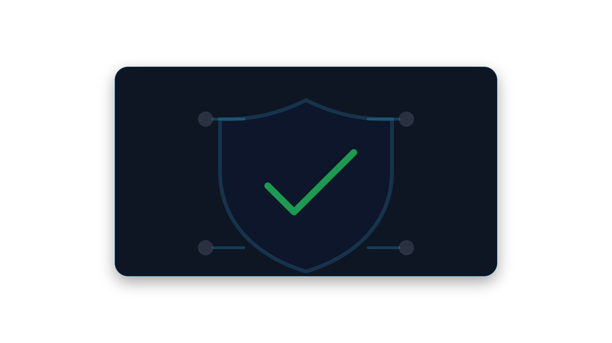

Sistem mengatur **siapa lihat apa** berdasarkan jabatan:

- **Admin ranting** → Hanya data rantingnya
- **Ketua cabang** → Data seluruh ranting di cabangnya
- **Pengurus provinsi** → Data cabang-cabang di provinsinya
- **Superadmin** → Semua data dan pengaturan

*Tidak ada yang bisa mengakses data di luar wewenangnya.*

---

## Pengaturan (Hanya Superadmin)

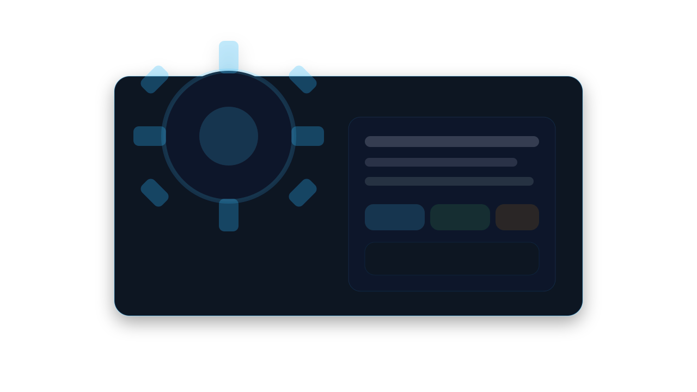

Jika Anda Superadmin, ada halaman **Settings** untuk:

| Bagian | Kegunaan |
|--------|----------|
| **Users** | Tambah pengguna baru, atur jabatan, ganti password, lihat log aktivitas |
| **Master Data** | Kelola data inti sistem: **Menu Sidebar** + **Konfigurasi Fitur**, serta **DB Viewer** (lihat tabel/kolom, read-only) |

---

## Alur Singkat: Dari Login sampai Pakai

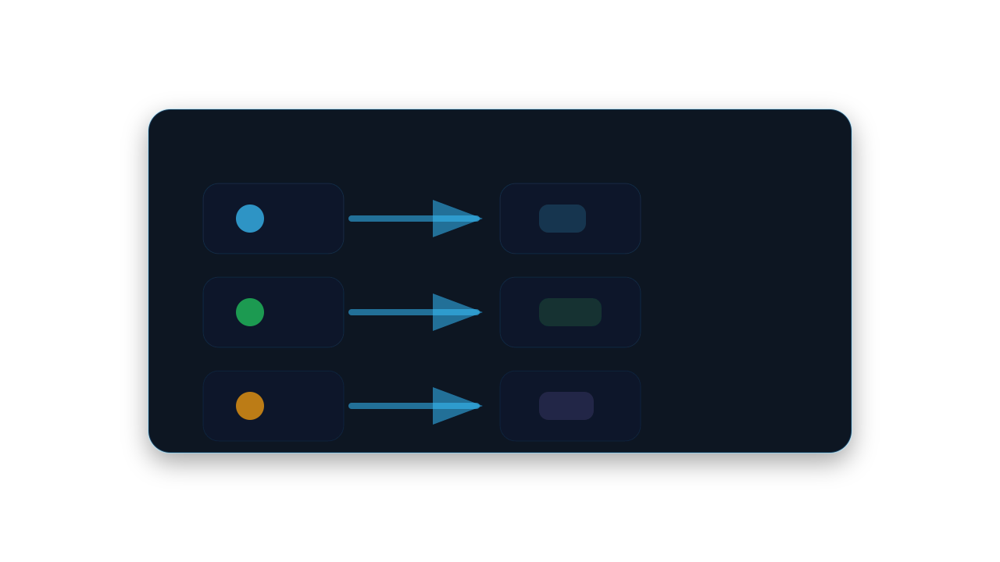

1. **Buka aplikasi** di browser → halaman login
2. **Masuk** dengan email & password yang sudah didaftarkan
3. **Dashboard** muncul — pilih menu di kiri sesuai kebutuhan (Keanggotaan, UKT, Keuangan, dll.)
4. **Kerjakan tugas** — input data, cetak kartu, lihat laporan, sesuai fitur yang dipilih
5. **Logout** setelah selesai (terutama jika pakai komputer bersama)

---

## Contoh Skenario Sehari-hari

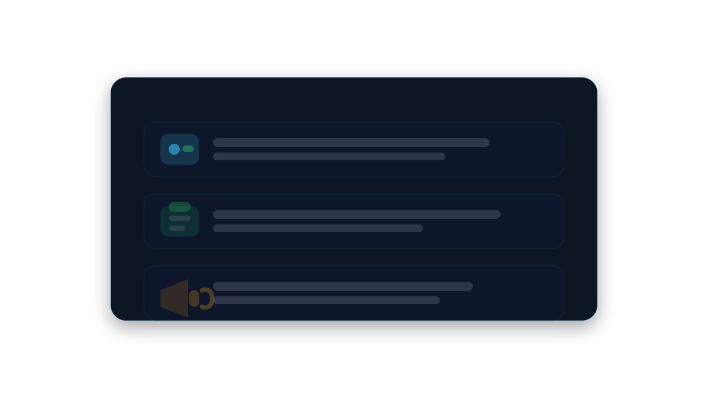

**Skenario 1:** Admin ranting ingin cetak kartu anggota baru  
→ Login → Keanggotaan → Cari anggota → Preview kartu → Cetak/unduh PDF

**Skenario 2:** Ketua cabang ingin cek daftar peserta UKT  
→ Login → Audit Ujian (UKT) → Lihat daftar pendaftar per ranting

**Skenario 3:** Pengurus ingin lihat ringkasan event aktif  
→ Login → Dashboard → Lihat card "Event Aktif" dan feed pengumuman

---

## Daftar Singkatan

- **UKT**: Ujian Kenaikan Tingkat  
- **OTP**: Kode verifikasi sekali pakai (mis. lewat WhatsApp/SMS)  
- **RBAC**: Aturan akses berdasarkan peran/jabatan (siapa boleh lihat/ubah apa)  
- **RLS**: Aturan akses langsung di database (data dibatasi sesuai wilayah/jabatan)  
- **API**: “Pintu layanan” untuk komunikasi aplikasi dengan server/database  
- **DB**: Database (tempat penyimpanan data)  
- **WA**: WhatsApp (mis. untuk kirim notifikasi/konfirmasi)  
- **PDF**: Format dokumen untuk cetak/unduh (contoh: kartu anggota, kwitansi)  
- **CI/CD**: Proses otomatis untuk build, test, dan rilis aplikasi  
- **PWA**: Web yang bisa dipasang seperti aplikasi di HP (opsional)

---

## Dibangun dengan Teknologi Modern

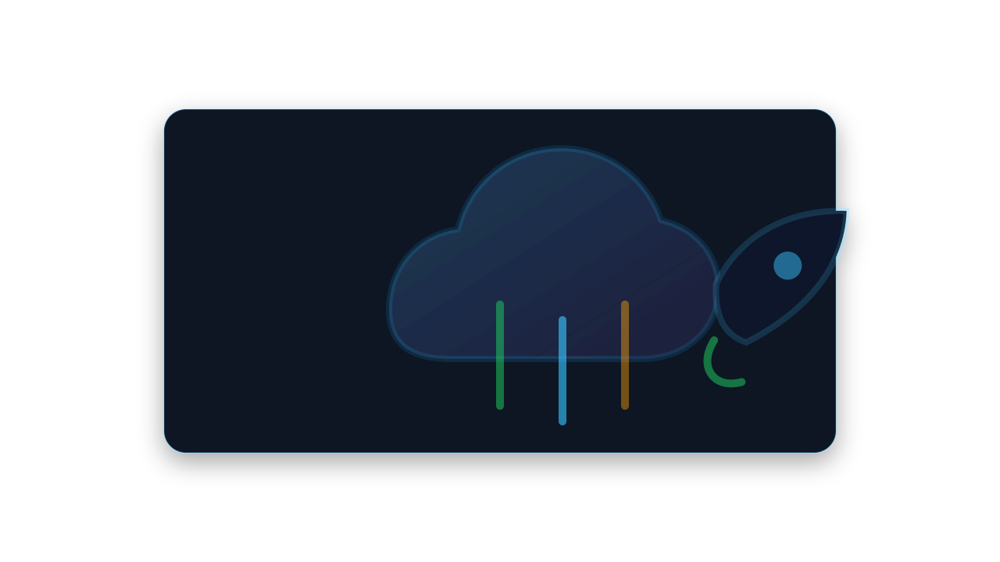

inkai-app memakai teknologi terkini agar:

- **Cepat** — Halaman muat dengan baik di HP dan laptop
- **Aman** — Data tersimpan dengan enkripsi dan aturan akses ketat
- **Stabil** — Bisa dipakai banyak pengguna bersamaan
- **Mudah dikembangkan** — Fitur baru bisa ditambah seiring kebutuhan organisasi

---

## Untuk Tim Profesional (Operasional & Manajemen)

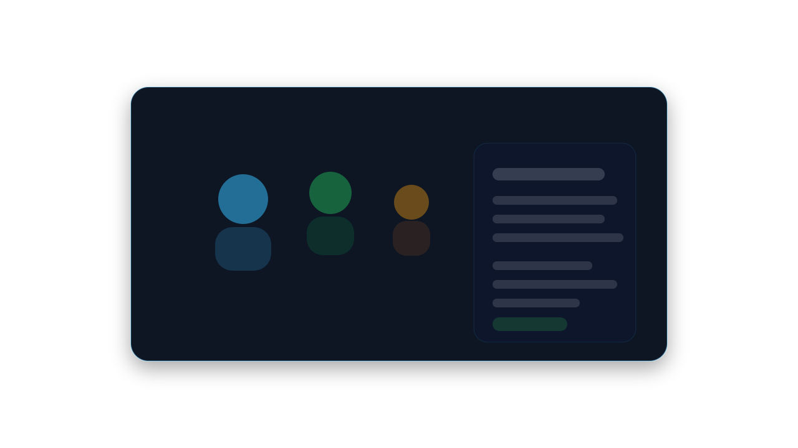

**Fokus:** memastikan operasional organisasi jalan rapi, konsisten, dan mudah diaudit.

- **SOP data**: format input yang seragam (anggota, UKT, keuangan) → mengurangi salah tulis/duplikasi
- **Pelaporan cepat**: ringkasan per ranting/cabang/provinsi sesuai kebutuhan rapat
- **Kontrol akses**: pembagian tugas jelas (siapa input, siapa review, siapa approve)
- **Pelatihan pengguna**: panduan 1 halaman + simulasi 3 skenario (cetak kartu, UKT, laporan)

---

## Untuk Tim IT (Teknis)

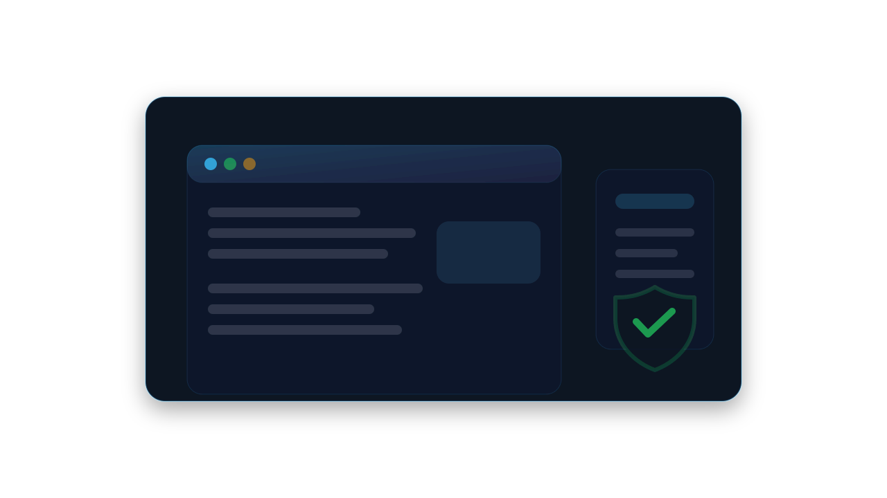

**Fokus:** stabilitas, keamanan, dan kemudahan pengembangan.

- **Stack**: Next.js (App Router) + Supabase (Auth & DB)
- **Keamanan**: login, pembatasan akses per peran, dan aturan data (RLS) di database
- **Operasional**: env parity (lokal vs deploy), build & lint, smoke check sebelum rilis
- **Pengembangan**: modul per fitur (dashboard/modules) + API route handlers (app/api) → mudah tambah fitur

---

## Ringkasan

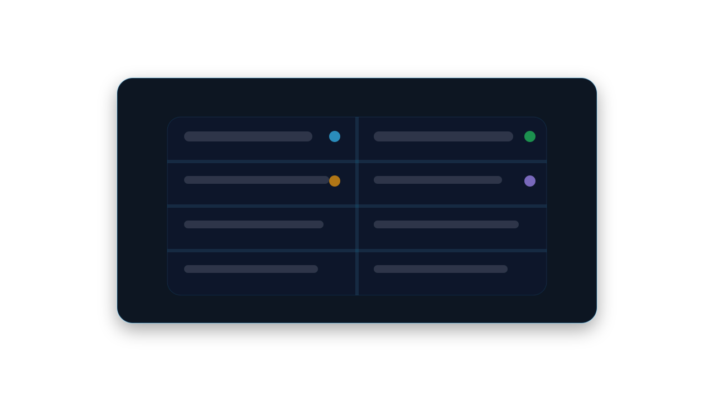

| Aspek | Keterangan |
|-------|------------|
| **Apa** | Aplikasi web untuk mengelola organisasi (keanggotaan, keuangan, ujian, event) |
| **Siapa** | Admin ranting, ketua cabang, pengurus provinsi, superadmin |
| **Keuntungan** | Data terpusat, hemat waktu, aman, transparan, kartu digital |
| **Akses** | Login lewat browser (HP/laptop), menu menyesuaikan jabatan |

---

<!-- _class: lead -->

# Terima kasih

**inkai-app** — Satu aplikasi untuk mengelola organisasi dengan rapi dan aman.

*Ada pertanyaan?*
